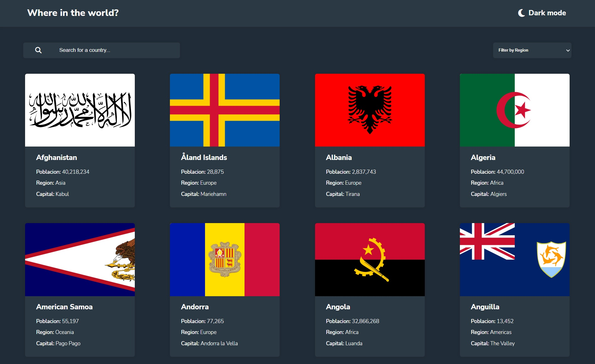
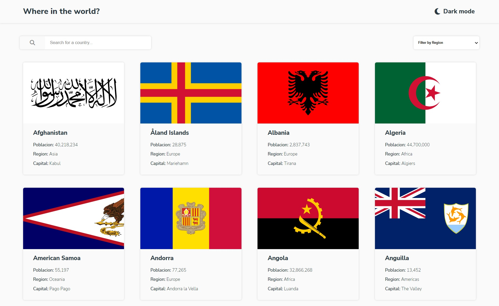
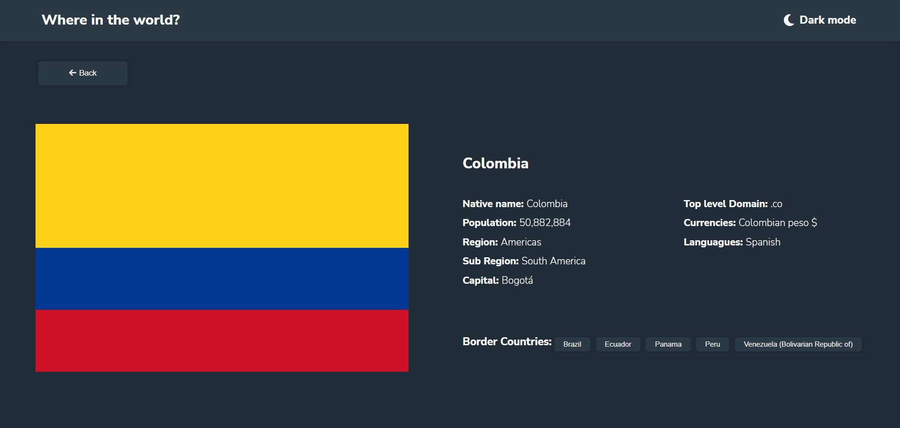
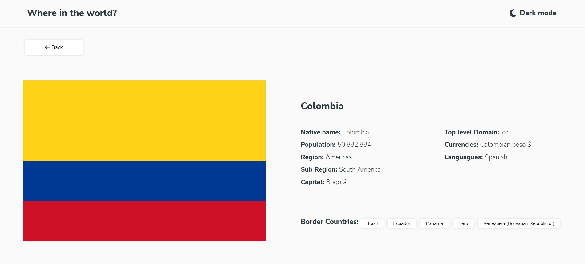
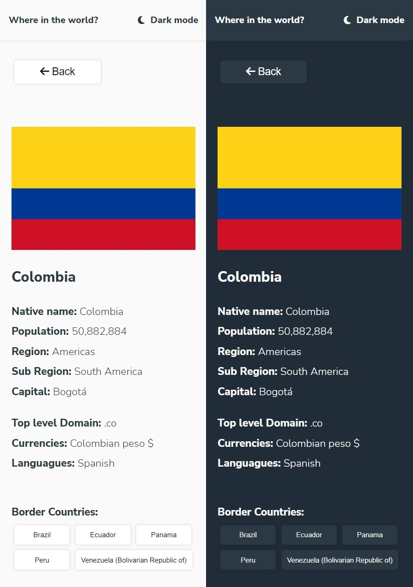

# Frontend Mentor - REST Countries API with color theme switcher solution

This is a solution to the [REST Countries API with color theme switcher challenge on Frontend Mentor](https://www.frontendmentor.io/challenges/rest-countries-api-with-color-theme-switcher-5cacc469fec04111f7b848ca). Frontend Mentor challenges help you improve your coding skills by building realistic projects. 

## Table of contents

- [Overview](#overview)
  - [The challenge](#the-challenge)
  - [Screenshot](#screenshot)
  - [Links](#links)
- [My process](#my-process)
  - [Built with](#built-with)
  - [Useful resources](#useful-resources)
- [Author](#author)
- [Acknowledgments](#acknowledgments)

## Overview

### The challenge

Users should be able to:

- See all countries from the API on the homepage
- Search for a country using an `input` field
- Filter countries by region
- Click on a country to see more detailed information on a separate page
- Click through to the border countries on the detail page
- Toggle the color scheme between light and dark mode *(optional)*

### Screenshot

### Links

- Solution URL: [github](https://github.com/baxx1199/country_app)
- Live Site URL: [Country app](https://baxx1199.github.io/country_app/)

## My process

### Built with

- Semantic HTML5 markup
- Sass
- Flexbox
- [Angular 13](https://angular.io/) - JS library

### Useful resources

-  - With this article I understood much better how the SASS @use rule works
-  - This helped me better understand type compatibility for behaviorsubject()

## Author

- Website - [J Julian Cobos bautista](https://baxx1199.github.io/portafolio/)
- Frontend Mentor - [@baxx1199](https://www.frontendmentor.io/profile/baxx1199)

## Acknowledgments

while looking for the best option to show a theme in dark mode I found the video of Kelvin Mai in which to develop this function through a service and I thought the better option.

- 
============================================================

# CountriesApp

This project was generated with [Angular CLI](https://github.com/angular/angular-cli) version 13.0.2.

